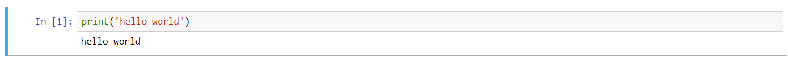
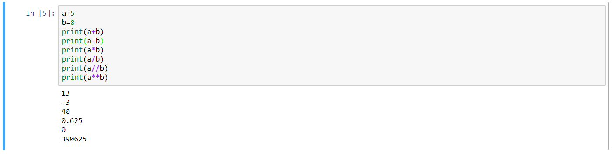
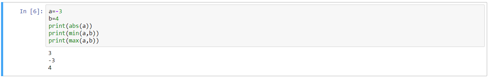
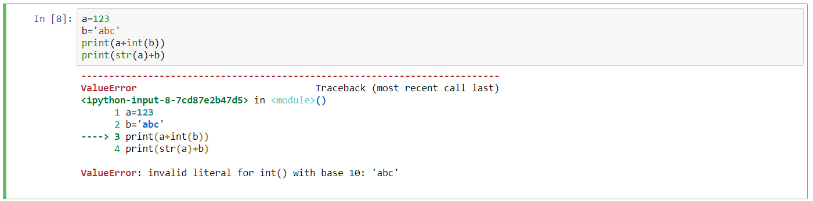
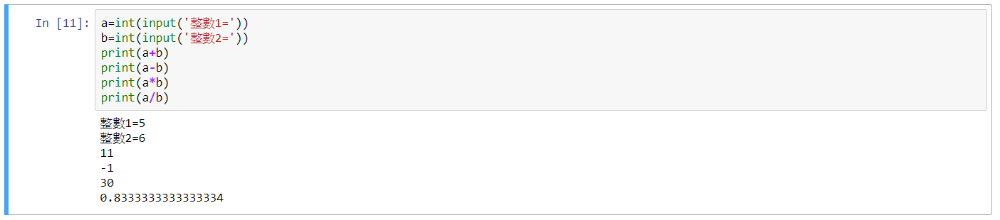
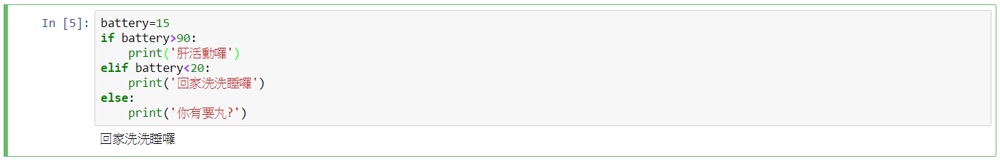

Title: Python基本語法-1
Date: 2018-02-28 11:20
Category: 40423248
Tags: Basic
Slug: 2018 Basic
Author: 40423248

###這部分大概記錄一些之前學過的基本語法,用jupyter來做練習,以後會再繼續增加所學到的語法

<!-- PELICAN_END_SUMMARY -->

###1.列印print() :
####指定印出括號中的內容,只有括號的話是印出數字,括號內再加入單引號('')可印出文字,這裡輸入hello world,如下圖所示:

###2.分類type():
####可以做分類,如指定a=123,把a輸入到括號中,type(a),系統就會告訴你這是甚麼,a為int數字或是指定b='123',系統會告訴你b為字串,因為加了''這兩點,系統認定這是字串,又或是定義c=8.70,系統會告訴你c為浮點數,如下圖所示:

###3.簡單的運算:
####先給幾個定義,如:a=5 , b=8
####再輸入一些運算符號跟print,如:
####print(a+b)   相加
####print(a-b)   相減
####print(a*b)   相乘
####print(a/b)   相除,取小數點
####print(a//b)  相除,不取小數點
####print(a**b)  平方和
####如下圖所示:

###4.取定義:
####可以取定義和取大小,如:a=-3 b=4
####在print中加入abs,為絕對值,現在a是負值,加入後改為print(abs(a)),出現的是正值的3
####或是加入min,此為最小值,可以在前面定義的數字中尋找最小值,改為print(min(a,b))
####或是加入max,此為最大值,可以在前面定義的數字中尋找最大值,改為print(max(a,b)),如下圖所示:

###5.數字與字串相加:
####

###6.輸入資料input():
####隨便取一個代號為變數,如取a;
####a =input()         ==>這裡在執行時會變成輸入列,可任意輸入字串或數字之類的東西
####print('a=' ,a)      ==>這裡會印出所輸入的東西
####或是輸入名稱, 如b= input('Your name: ')      ==>任意給一個名子
####print('Your name:' , b)       ==>這裡會印出所輸入的名子   ,如下圖:

###也可以跟簡易運算搭配,如下圖:

###7.if判斷式:
####

###8.
####

