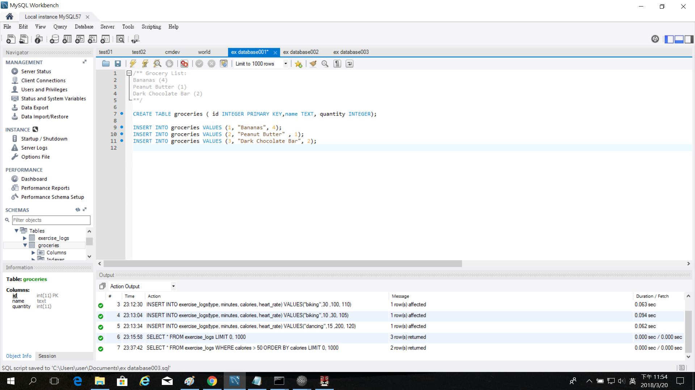

Title: SQL-建立資料庫-1
Date: 2018-03-02 11:20
Category: 40423248
Tags: SQL-1
Slug: 2018 SQL-1
Author: 40423248

###這裡是介紹如何使用SQL來建立一個簡易的資料庫

<!-- PELICAN_END_SUMMARY -->

###(1)建立:
####第一張圖的CREATE DATABASE就是建立資料庫的指令, Test001是此資料庫的名稱,第二行的USE是轉移資料庫的指令

###(2)備註:
####/** Grocery List:
####Bananas (4)
####Peanut Butter (1)
####Dark Chocolate Bar (2)
####**/
以上這段灰色的文字是備註這個資料庫所含有的內容,建立表格時需要放入這些東西

###(3)建立及分類:
####CREATE TABLE groceries ( id INTEGER PRIMARY KEY,name TEXT, quantity INTEGER);
####這段是建立表格的形式及分類欄位;
####CREATE TABLE是建立表格

###(4)插入資料:
####

